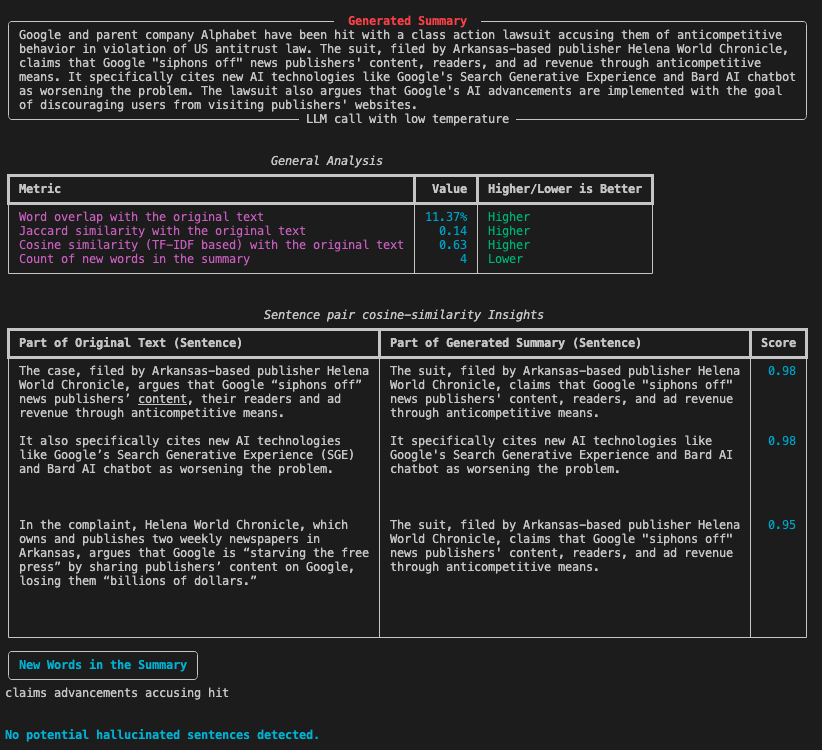

# 📝 Reference-Free automatic evaluation for text summarization

Elegantly automate text summarization evaluation in a context-based, reference-free manner, featuring aesthetically pleasing and easily interpretable results.




## Features

- **Custom Metrics**: Utilize metrics such as word overlap and Jaccard similarity for in-depth content analysis.
- **Hallucination Detection**: Systematically identify hallucinated content in summaries by analyzing semantic discrepancies with the original text, also use new word detection to identify potentially hallucinated summaries.
- **GPT-based Evaluation**: Employ GPT models for nuanced qualitative assessments of summaries.
- **Adapted ROUGE & BERTScore**: Rework traditional metrics for use in a reference-free context, focusing on the intrinsic qualities of summaries, as highlighted in [Eugene Yan's writing](https://eugeneyan.com/writing/abstractive/).

## Main Functionality

The `main.py` script serves as the entry point for the project. It is designed to process a text file (e.g., `news.txt`) and automatically perform a comprehensive evaluation of the contained summary. The script orchestrates the entire evaluation process, leveraging various metrics and models to assess the quality of the summary text.

## Installation

Clone the repository and install dependencies:

```bash
git clone https://github.com/Muhtasham/summarization-eval
cd summarization-eval
pip install -r requirements.txt
```

### Usage

To use the script, simply provide a text file containing the summary to be evaluated. The script reads the file, processes the summary, and outputs the evaluation results in a structured and readable format in the terminal.

Example:

```bash
python main.py --input_file "assets/news.txt"
```

This command will process the summary in `news.txt`, evaluating it using the suite of metrics and models integrated into the project.

**Note**: You will need to have an OpenAI API key set up in your environment to run the script.

## Contributing

Contributions to enhance and expand this project are welcome. Please see the `CONTRIBUTING.md` file for guidelines on how to contribute.

## License

This project is licensed under the [MIT License](LICENSE).
